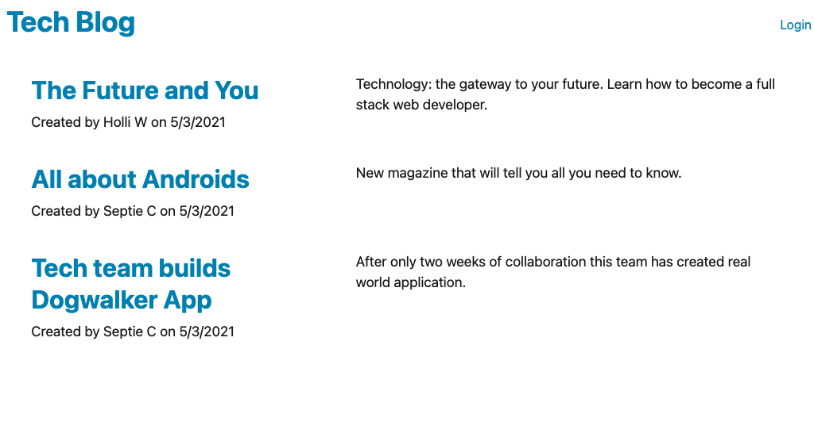
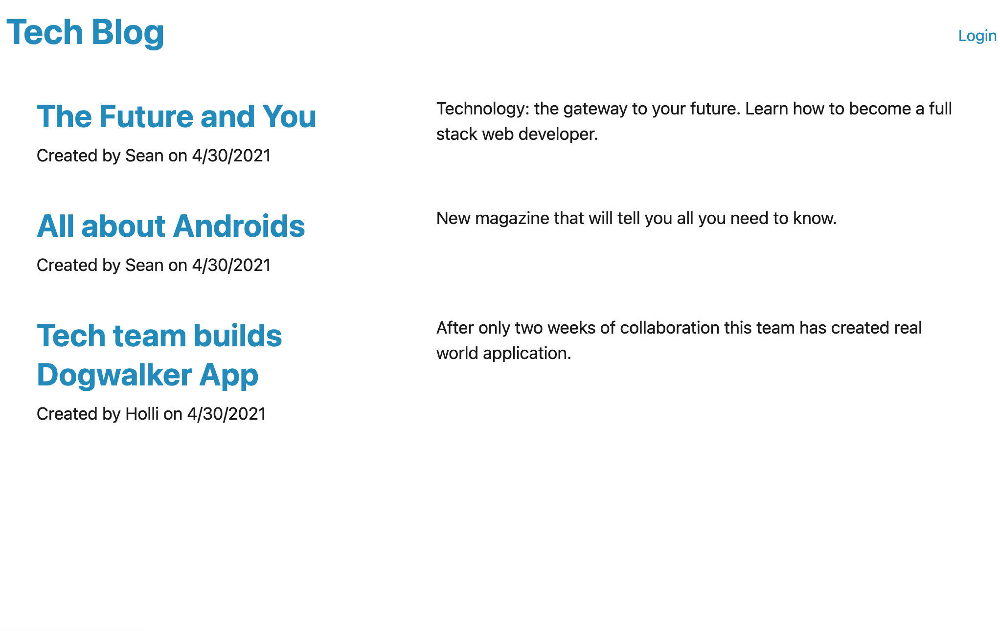
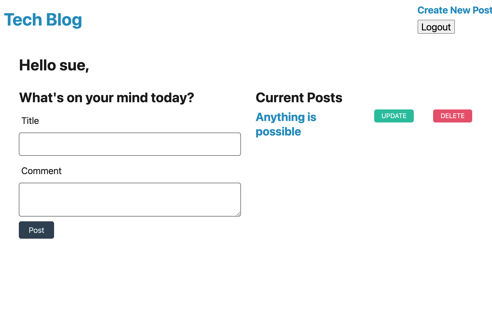
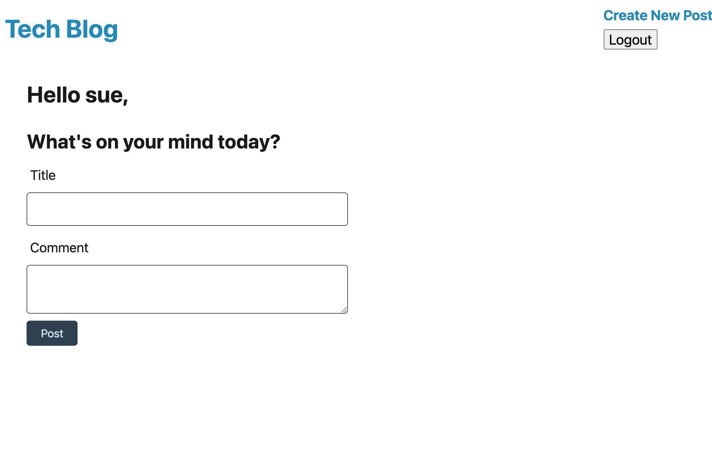
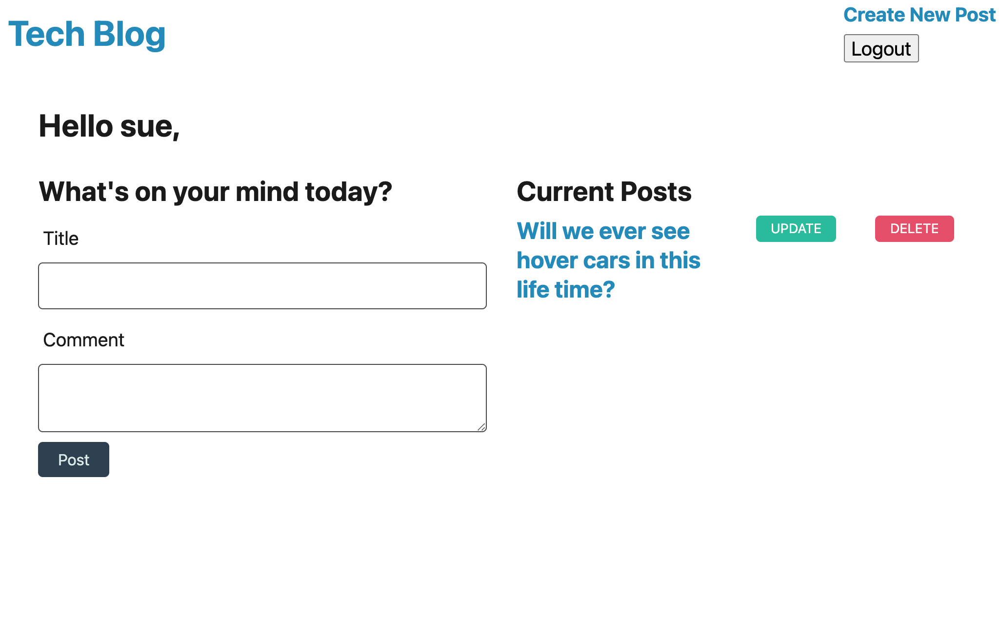

# Tech-Blog
## Objective
Your task this week is to build a CMS-style blog site similar to a Wordpress site, where developers can publish their blog posts and comment on other developers’ posts as well. You’ll build this site completely from scratch and deploy it to Heroku. Your app will follow the MVC paradigm in its architectural structure, using Handlebars.js as the templating language, Sequelize as the ORM, and the express-session npm package for authentication.

## Technologies Used
* HTMl
* JavaScript
* Jass CSS
* Node js
* bcrypt
* connect-session-sequelize
* dotenv
* express
* express-handlebars
* express-session
* Mysql2
* Sequelize

## Project Screenshots 

Application with only Jass css.

## Contact
* https://github.com/srad25
* https://github.com/srad25/Tech-Blog